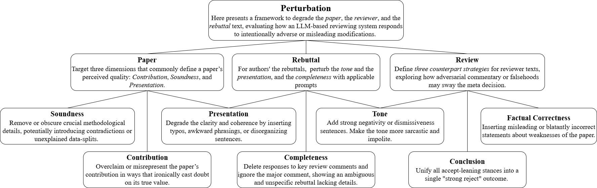

# Peer-Reviewed Publications

## Understanding Voter Fraud Misinformation Videos during the 2024 Taiwan Election on YouTube
**Li, Yanheng**, Wang, Da, & Wang, Yuping.  
Accepted and forthcoming in **CSCW 2025**. [[PDF](/assets/papers/yanheng_taiwan_misinfo_cscw516.pdf)]

**Short Abstract:** 
This paper presents a mixed-method analysis of voter fraud misinformation on YouTube during Taiwan’s 2024 election. Using a computational pipeline and manual coding, we identify videos discussing ballot-related fraud claims. Our findings show that Democratic Progressive Party (DPP)-aligned accounts produced the most such content, which drew more comments but fewer likes than other videos. Case studies reveal distinct strategies: some media outlets and grassroots accounts promoted fraud claims, while DPP-linked channels often refuted them. This study sheds light on the dynamics of multi-modal voter fraud misinformation in Taiwan and informs global efforts to mitigate its spread.

keywords:
Misinformation, Election, Social Media, YouTube, Multimodal, Videos

I designed the human-in-the-loop pipeline to analyze **5,000+** YouTube videos,.
- Including data collection, identification of voter-fraud videos, multi-modal and statistical analysis.
- Applied a **human-in-the-loop pipeline** (transcripts and misinformation typology coding).  

  
  
Pipeline overview of Taiwan voter fraud study

The analysis yields several findings;
- Video accounts aligned with the Democratic Progressive Party (DPP) produce the highest number of videos discussing voter fraud misinformation.
- Videos discussing such misinformation tend to receive more comments but fewer likes compared to videos without this content _(Engagement metrics comparison)_.
- Voter-fraud Videos associated with the DPP are quite distinct from those linked to the Kuomintang (KMT) or Taiwan People's Party (TPP), with unique characteristics that may be further revealed through their audio and video features _(Multi-modal analysis and comparison of videos across publisher parties)_.
- Voter-fraud videos by traditional media accounts tend to exhibit a more standardized tempo, higher brightness, greater visual complexity (entropy), and higher face presence compared to grassroots accounts _(Multi-modal analysis and comparison of videos across publisher types)_.
- Case studies highlight several key divergences compared with voter fraud misinformation in the 2020 U.S. presidential election, particularly in terms of narrative strategies.

  
  
Findings: Engagement metrics comparison across videos types

  

    
    
Findings: Multi-modal analysis and comparison of videos across publisher parties

  

  

    
    
Findings: Multi-modal analysis and comparison of videos across publisher types

  

---

## Aspect-Guided Multi-Level Perturbation Analysis of Large Language Models in Automated Peer Review
Li, Jiatao., **Li, Yanheng**, Hu, Xinyu., Gao, Mingqi., & Wan, Xiaojun.  
Accepted and forthcoming in *CIKM 2025*. [arXiv:2502.12510](https://arxiv.org/abs/2502.12510)

**Short Abstract:** 
We introduce an aspect-guided perturbation framework to diagnose vulnerabilities of Large Language Models (LLMs) in peer review. By perturbing papers, reviews, and rebuttals along dimensions such as contribution, soundness, presentation, tone, and completeness, we reveal where LLM reviewers are most error-prone. Our analysis across major LLMs (GPT-4o, Gemini 2.0, LLaMA 3, etc) highlights recurring weaknesses, including misjudging methodological flaws, over-weighting strong rejections, mishandling incomplete rebuttals, and misinterpreting poor critiques as rigorous. These findings provide actionable insights for building balanced human–AI peer review partnerships.

keywords:
Aspect-Guided Perturbation, Automated Peer Review, Robustness Evaluation, Bias Analysis

  
  
Pipeline overview of Taiwan voter fraud study

<!-- 

  
  
Findings: distribution of voter fraud misinformation videos

 -->

<!-- 

  
  
Findings: ECDF comparison across categories

 -->

I co-examine the robustness of LLMs when used as automated peer reviewers.  
- Co-Designed an **aspect-guided multi-level perturbation framework**.  
- Co-Evaluated multiple LLMs on review tasks.  
- Found systematic **cognitive biases and stability gaps**.  

---

# Under Review Working Papers
(For discussion and more details, please contact me directly)
## Understanding Participatory Amplification on YouTube in the Late December 2024 U.S. Government (Almost) Shutdown Crisis  
**Li, Yanheng**, Wang, Da, & Wang, Yuping. Under review.

**Short Abstract:** 
Under the context of the late-December 2024 U.S. government (almost) shutdown crisis, we analyzed 11,263 YouTube videos and 466,994 comments to examine how users engaged with political turmoil online. Using a multi-run human-in-the-loop pipeline, we identified 518 “amplifiers”—commenters whose threads attracted disproportionate replies—and developed an amplifier index to capture their influence. Two patterns emerged: occasional amplifiers, often tied to influencer uploads, and frequent amplifiers, who engaged across multiple YouTubers. Our findings reveal how amplifier behavior and platform affordances shape information diffusion during crises, offering insights for designing more responsive social media systems.

## Analyzing Cognitive Differences Among Large Language Models through the Lens of Social Worldview 
Li, Jiatao., **Li, Yanheng**., & Wan, Xiaojun. [arXiv:2505.01967](https://arxiv.org/abs/2505.01967). Under review.